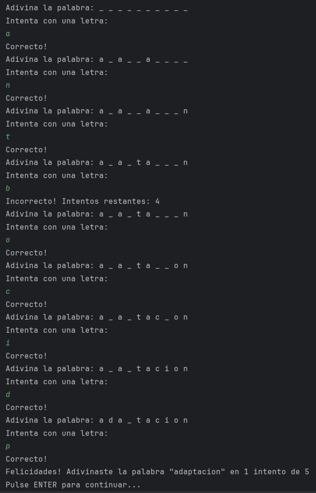
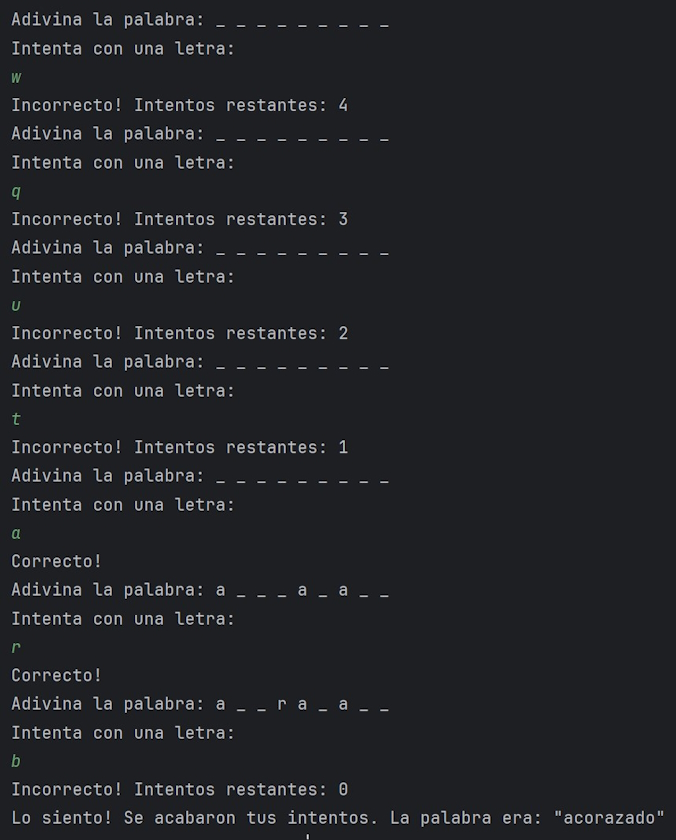

[](https://classroom.github.com/a/XkGUJ3tv)
# Recuperación - Ejercicio 1.

Se trata de desarrollar un programa mediante el paradigma de la POO que muestre un menú con 3 opciones y realice las acciones que se detallan a continuación.

## 1. Menú de la aplicación.

La aplicación debe mostrar un menú con las siguientes opciones:

```kotlin
1. Generar serie.
2. Jugar al ahorcado.
3. Salir.
Por favor, selecciona una opción: 
```

Dicho menú debe ser creado en una clase que debe implementar el siguiente contrato:

```kotlin
interface IMenu {
   fun mostrarMenu()
   fun generarSerie()
   fun jugarAhorcado() 
}
```
   
## 2. Info de E/S en una clase.
   
La información que mostramos y recibimos de la consola se debe manejar con una clase específica para ello. Esta clase debe inyectarse correctamente a las clases que la necesiten para cumplir el principio SOLID DIP. 

***No será válido la creación de un Object o un Companion object para realizar esta labor***.
     
## 3. Generar serie.
       
La opción 1 del menú, ```Generar Serie```, debe crear un rango aleatorio entre 1 y 100 y después solicitar un valor que debe estar dentro de dicho rango. El rango debe tener, al menos, 30 números entre el valor mínimo y el máximo. 
Una vez creado internamente un rango que cumpla dichos requisitos, mostrará un mensaje como el que sigue:

```kotlin
Inserte un número [23-77] ->
```

En este ejemplo se ha generado aleatoriamente el rango 23-77, que está dentro de 1-100 y entre los valores mínimo y máximo existen, al menos, 30 números (77 - 23 = 54)

Dependiendo del número introducido, si está más cercano al mínimo o al máximo del rango deberá mostrar un tipo de serie u otra.

### 2.1. Serie Creciente.
      
Si el número introducido está más cerca del máximo, por ejemplo si introducimos el valor 53, debe mostrar lo siguiente:
      
```kotlin
Inserte un número [23-77] -> 53
```

```kotlin
53 (0)
53+54 (1)
53+54+55 (2)
53+54+55+56 (3)
53+54+55+56+57 (4)
53+54+55+56+57+58 (5)
...
53+54+55+...+77 (24)
Suma => 1625
```

La `Suma` final de la serie corresponde con la suma de todos los números desde el número introducido al máximo del rango.

### 2.2. Serie Decreciente.

Si por el contrario se introdujo el número más cercano al valor inferior, por ejemplo el 30:

```kotlin
Inserte un número [23-77] -> 30
```

```kotlin
01 -> 30+29+28+27+26+25+24+23 = 212
02 -> 30+29+28+27+26+25+24 = 189
03 -> 30+29+28+27+26+25 = 165
04 -> 30+29+28+27+26 = 140
05 -> 30+29+28+27 = 114
06 -> 30+29+28 = 87
07 -> 30+29 = 59
08 -> 30 = 30
Total => 996
```

El `Total` será la suma de los totales de cada fila, es decir, `996 = 212+189+165+140+114+87+59+30`.

Para desarrollar estas series, debes crear la clase ```GeneradorSeries```, que será un patrón singleton, es decir, solo debe existir una instancia del objeto e implementará como mínimo los siguientes 4 métodos:
   
   - ```generarRangoAleatorio()```: retorna los valores minimos y máximos de nuestro rango. Debe cumplir que el rango generado tenga al menos 30 números y esté dentro de los valores de referencia 1-100.
	  
	 - ```generarSerie()```: retorna la serie correcta.
	  
	 - ```serieCreciente()```: retorna la serie cuando el número introducido por el usuario está más cercano al rango superior... será llamado desde ```generarSerie()```.
	  
	 - ```serieDecreciente()```: retorna la serie cuando el número introducido por el usuario está más cercano al rango inferior... será llamado desde ```generarSerie()```.
	  
	 - Declarar también las constantes que determinan el mínimo y máximo dónde podemos generar nuestro rango, es decir, 1 y 100.
	  
	 - ***IMPORTANTE***: Los parámetros de entrara y retorno de cada método lo debes definir tú.
   
## 4. Jugar al ahorcado.
   
* Esta opción muestra el típico juego del ahorcado. Para ello debes desarrollar una clase ```Ahorcado```, en cuyo constructor primario tendrá la propiedad que define los intentos máximos *(por defecto 5)*. 
   
* Tendrá otra propiedad, que se declarará fuera del constructor, y obtendrá la palabra oculta que debemos adivinar *(usará el método ```obtenerPalabraAleatoria()``` que debes desarrollar en la clase ```Palabra```)*.
   
* La clase ```Ahorcado``` debe tener como mínimo el método ```jugar()```.
   
* Debes crear una clase ```Palabra``` que solo contendrá constantes, una data class y 3 métodos... ```TODOS serán estáticos```:

   ```kotlin
   import com.google.gson.Gson
   import java.io.File
   
   RUTA_TEXTO = "src/palabras.txt"
   RUTA_JSON = "src/palabras.json"
   ES_JSON = true
   
   data class Palabras(val palabras: List<String>)
   
   fun leerFicheroTexto(ruta: String): List<String> = File(ruta).readLines()

   fun leerFicheroJSON(ruta: String): List<String> {
      val json = File(ruta).readText()
      return Gson().fromJson(json, Palabras::class.java).palabras
   }
   ```
   
* Debes desarrollar la función ```obtenerPalabraAleatoria()``` que retornará una palabra de forma aleatoria.
   
* También debes decidir qué modificador de visibilidad debe llevar cada uno.
   
* IMPORTANTE: la función ```jugarAhorcado()``` de la clase ```GestorMenu``` realizará una llamada al método ```jugar()``` de la clase ```Ahorcado``` directamente haciendo una llamada a una instancia de dicha clase, pero sin crear ninguna variable.

* El juego debe desarrollarse y mostrar los mensajes de la siguiente manera...

   - Juego cuando aciertas la palabra oculta dentro del máximo de intentos permitidos *(pierdes un intento solo cuando la palabra oculta no contiene la letra introducida)*:

   

  - Juego cuando no eres capaz de acertar la palabra oculta en los intentos máximos permitidos *(si la palabra no contiene una letra introducida debe mostrar los intentos que restan)*:

   
   
## 5. Salir:
   
Mostrará el mensaje "Saliendo..." y se acabará el programa.

## 6. Aspectos a tener en cuenta.

* Realizar la inyección de dependencias de todas las clases cumpliendo el principio SOLID DIP.
   
* Realizar un control de los posibles errores y excepciones que puedan lanzarse durante la ejecución del programa.

* NO DEBE EXISTIR ningún print, println, readln(), etc dentro de las clases de nuestro programa, ya que debe existir una clase que se dedicará de manera específica a esa labor y será inyectada correctamente dónde sea necesario su uso.

* ***EL PROGRAMA DEBE FUNCIONAR PARA SER EVALUADO***.

* Las clases y métodos deben tener su documentación realizada correctamente con KDOC.

